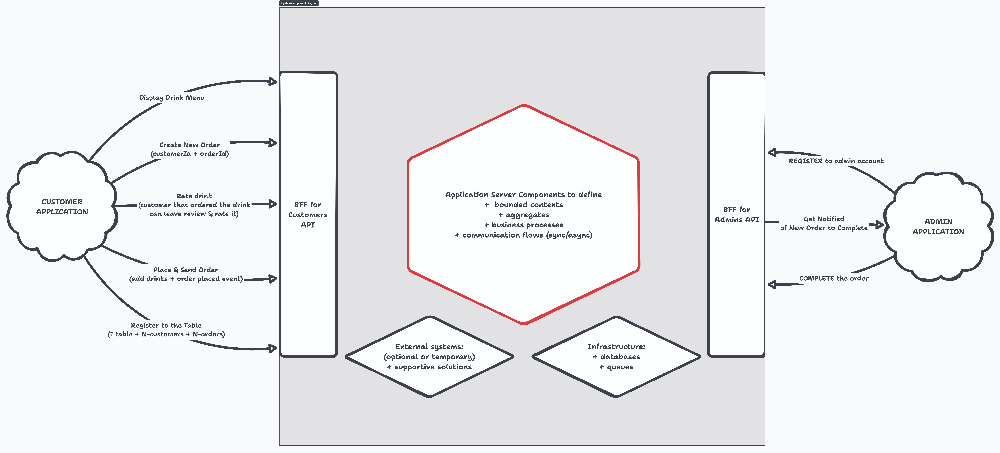

# Documentation and Progress Tracking Log
<i>This document serves as a log for the processes documentation and progress plan of the project.</i>

## Documentation
### Business Processes

### Feature Identification
- **Objective**: Identify the main features of the system.
  - right now let's focus on the basic feature of ordering the drinks
  - later expand the ordering with payment features based on the price of the order
- **Method**: Brainstorming session with team members.
- **Outcome**: A list of features that the application will support.
  - display drink menu
  - select drinks for an order
  - place an order
  - view order status
  - cancel order
  - complete order
- **Tools**: Whiteboard, sticky notes, and markers.

### Main Entities
- **Actors**: Identify the main actors involved in the application.
  - Customer — for selecting drinks and placing an order, displaying order status, and canceling the order
  - Admin — for completing the order; right now everyone on the employee side can complete the order
  - (later) Waiter & Barista...
- **Entities**: Identify the main entities that will be used in the application.
  - Drink — right now static list of drinks (later customizable drinks)
  - Order — represents a single customer's order
  - Table — represents a table in the bar for multiple customers that can place their orders
    - later: Waiters can be assigned to tables and customers to track their schedule and payments + tips 

- **Events**: Identify the main events that occur in the application.
- **Challenges**:
  - identify main aggregates to support business processes of the application
  - identify main bounded contexts to support business processes of the application
  - identify main policies to support business processes of the application
  - identify main read models to support business processes of the application

### Initial Architecture
- **Objective**: Draw an initial architecture diagram to visualize the system components and their interactions.
- **Method**: Use a diagramming tool to create the architecture diagram.
- **Outcome**: A visual representation of the system architecture, including components, services, and their interactions.
- **Tools**: Draw.io, Lucidchart, Structurizr, or similar diagramming tools

#### Starting Point: Initial Design Draft:
<i>This is a draft design of the system architecture with start-point processes, which will be refined as we progress through the documentation and development phases.  
Process initiators are divided on two groups now: customer-side and administrator-side. Therefore there might be a need to introduce two separate GUI for them.</i>

<i>Starting from red bordered hexagonal we will be defining main server side, backend components and services, communication between them and main aggregates within their contexts.</i>

### System Flows
- **Objective**: Describe the identified processes into system flows for components and their interactions.
- **Method**: Create flowcharts or sequence diagrams to illustrate the interactions between components.
- **Outcome**: A clear understanding of how components interact within the system, including data flows and event handling.
- **Tools**: Flowcharting tools like Lucidchart, Draw.io, Mermaid, or similar.

## Progress Plan
### Week 1-2:
- **Brainstorming Session**: Identify main features, actors, events & policies (plus unknowns)
- **Event Storming**: Conduct a session to visualize the domain events, actors, commands, and policies.
- **Documentation**: 
  - Document the identified features and events, divide features or group them into identified business processes & bounded contexts/aggregates to support them.
  - Draw initial architecture diagram to visualize the system components and their interactions.
  - Describe identified processes into system flows for components and their interactions.

...tbc.
